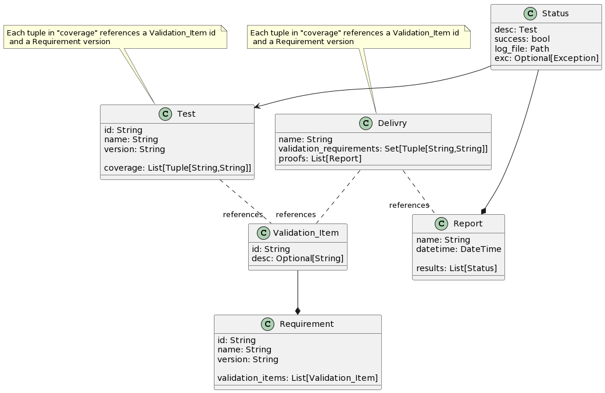

======================================
Gerance: Project requirement managment
======================================

:Authors: - Florian Dupeyron <florian.dupeyron@mugcat.fr>
:Date: May 2022 - October 2022
:Abstract: Gerance is a simple tool intended to manage your project's requirements and traceability.

Main idea
=========

Gerance is a python toolkit aiming at giving user tools to integrate traceability managment in their project easily.
we can see gerance as a kind of aggregator that accumulates requirements, validation items and proofs from various sources,
and gives tools to create reports in the user preferred output format.

Model
=====

Gerance works with a simple model:

   Model diagram for Gerance

This model is some lightweight representation of a classic V model procedure. There are requirements, each requirement can have various
checkpoint items. A delivry indicates what checkpoint items have to be verified for the delivry to be valid. A test verifies one or more
validation items. A Report acts as a proof statement.
